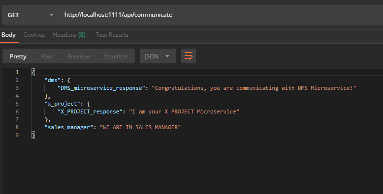

# Express Authorization for RS256-Signed Tokens

This sample demonstrates how to protect endpoints in an Express API by verifying an incoming JWT access token signed by Auth0. The token must be signed with the RS256 algorithm and must be verified against your Auth0 JSON Web Key Set.

## Getting Started

If you haven't already done so, [sign up](https://auth0.com) for your free Auth0 account and create a new client in the [dashboard](https://manage.auth0.com).

Clone the repo or download it from the Express API quickstart page in Auth0's documentation.

## Setup the `.env` File

If you clone the repo from GitHub, you will need to rename `default.env` to `.env` and provide these values manually [dashboard](https://manage.auth0.com).

## Install the Dependencies and Start the API

```bash
npm install
npm start
```

For each API

The API will be served at `http://localhost:${PORT}`.

The idea is to show example how to use JWT_TOKEN (Auth0) and to communicate between multiple APIs

## EXAMPLE

Each API has Public Endpoint (Do not require a valid JWT access token)
http://localhost:${PORT}/api/public

On the other side, each API has Private Endpoint (Requires a valid JWT access token)
http://localhost:${PORT}/api/private

In the Sales Manager API there is an Endpoint which fetch data from other APIs (DMS and X_Project including Sales Manger using JWT_TOKEN)
http://localhost:1111/api/communicate

#####Postman CALL Example


## Endpoints

The sample includes these endpoints:

**GET** /api/public
* An unprotected endpoint which returns a message on success. Does not require a valid JWT access token.

**GET** /api/private
* A protected endpoint which returns a message on success. Requires a valid JWT access token.

## License

This project is licensed under the MIT license. See the [LICENSE](LICENSE.txt) file for more info.
